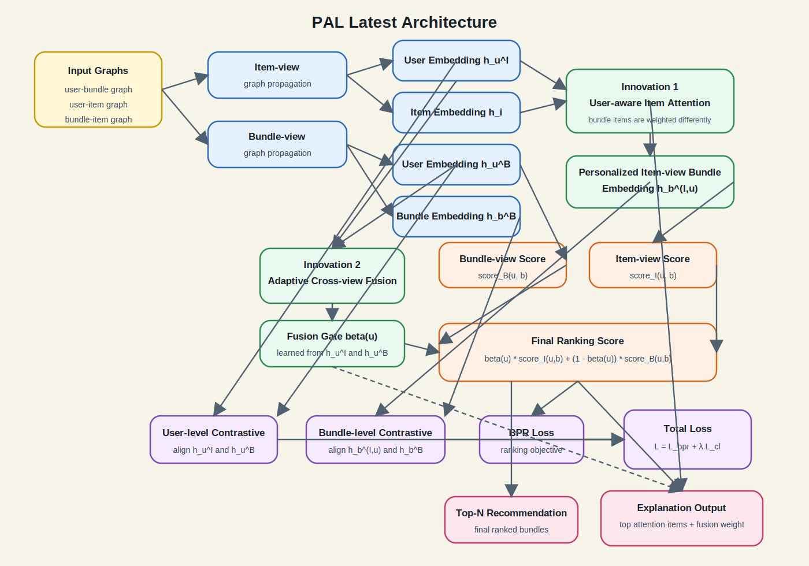

# PAL 最新架构说明

## 1. 架构定位

当前 `PAL` 的最新版本是在原始双视角 bundle recommendation 框架上，加入两层核心结构创新：

1. `User-aware Item Attention`
2. `Adaptive Cross-view Fusion`

它仍然保留原始 CrossCBR/PAL baseline 的两条表示学习路径：

- `Item-view`
- `Bundle-view`

但不再简单地把 bundle 内 item 做均匀聚合，也不再固定把两个 view 的分数直接相加。

## 2. 整体流程

整体可以分成 4 个阶段：

1. 图传播得到用户、item、bundle 的基础表示
2. 在 `item-view` 中做个性化 attention 聚合
3. 在 `item-view` 和 `bundle-view` 之间做自适应融合
4. 用 `BPR + cross-view contrastive loss` 训练

对应的数据图还是 3 张：

- `user-bundle` 图
- `user-item` 图
- `bundle-item` 图

## 3. 框架图

下面这张图概括了当前最新 PAL 的整体结构：



如果从模块作用来理解，这张图可以压缩成一句话：

```text
先分别学 item-view 和 bundle-view 表示，
再用 user-aware attention 生成个性化 bundle 表示，
最后用 adaptive fusion 决定当前用户更依赖哪条 view。
```

## 4. Baseline 部分

### 3.1 Item-view

在 `item-view` 中，模型先在 `user-item` 二部图上做传播，得到：

- 用户表示 `h_u^I`
- item 表示 `h_i`

然后通过 `bundle-item` 关系把 item 聚合成 bundle 表示。

### 3.2 Bundle-view

在 `bundle-view` 中，模型在 `user-bundle` 二部图上做传播，得到：

- 用户表示 `h_u^B`
- bundle 表示 `h_b^B`

### 3.3 原始 baseline 的问题

原始 baseline 的问题主要有两个：

1. `item-view` 下 bundle 表示默认由 bundle 内所有 item 平均贡献，不够个性化
2. 最终分数默认是两个 view 直接相加，无法体现不同用户对不同 view 的依赖程度

## 5. 创新 1：User-aware Item Attention

### 4.1 动机

同一个 bundle 对不同用户的吸引点并不一样。

例如一个 bundle 里同时有：

- RPG
- FPS
- Puzzle
- Indie

不同用户真正关注的 item 子集可能完全不同。

因此，bundle 的 `item-view` 表示不应该是固定的，而应该依赖当前用户。

### 4.2 核心做法

对于一个用户 `u` 和一个 bundle `b`，取出 bundle 里的所有 item 表示 `h_i`，然后计算注意力权重：

```text
alpha(u, b, i) = softmax(score(h_u^I, h_i))
```

当前实现支持两种打分方式：

- `dot`
  `score(h_u^I, h_i) = h_u^I · h_i`
- `mlp`
  `score(h_u^I, h_i) = MLP([h_u^I || h_i || h_u^I * h_i])`

然后用 attention 权重做加权聚合：

```text
h_b^{I,u} = Σ_i alpha(u, b, i) h_i
```

这里的 `h_b^{I,u}` 是一个和用户相关的 bundle 表示。

### 4.3 带来的变化

这样做之后，`item-view` 下的打分不再是：

```text
score_I(u, b) = (h_u^I)^T h_b^I
```

而是：

```text
score_I(u, b) = (h_u^I)^T h_b^{I,u}
```

也就是说：

- 同一个 bundle
- 对不同用户
- 可以有不同的 item-level 表示

这让模型更贴合 bundle recommendation 的本质。

### 4.4 推理阶段

训练时，只需要对 batch 内出现的正负 bundle 计算 attention。

测试时，如果采用 `user-aware` attention，就按 bundle 分块计算，避免一次性构造过大的
`users × bundles × items` 张量。

## 6. 创新 2：Adaptive Cross-view Fusion

### 5.1 动机

即使有了 attention，不同用户对两个 view 的依赖程度也可能不同：

- 有些用户的 item 历史更丰富，`item-view` 更可靠
- 有些用户的 bundle 交互更稳定，`bundle-view` 更可靠

如果仍然直接相加：

```text
score(u, b) = score_I(u, b) + score_B(u, b)
```

那就相当于假设两个 view 永远等权，这通常不合理。

### 5.2 核心做法

我们引入一个融合权重 `beta`：

```text
score(u, b) = beta(u) * score_I(u, b) + (1 - beta(u)) * score_B(u, b)
```

当前实现支持两种形式：

- `global fusion`
  整个模型共享一个可学习标量 `beta`
- `user fusion`
  对每个用户单独预测一个 `beta(u)`

在 `user fusion` 中，门控网络输入为两个用户表示的拼接：

```text
beta(u) = sigmoid(MLP([h_u^I || h_u^B]))
```

### 5.3 优点

这个结构的作用是：

- 让模型自动决定更依赖哪条 view
- 提升不同用户上的鲁棒性
- 让结果具备一定解释性

例如：

- `beta` 高，说明该用户更依赖 `item-view`
- `beta` 低，说明该用户更依赖 `bundle-view`

## 7. 训练目标

当前训练仍然保留 baseline 的双目标：

### 6.1 BPR Loss

主排序目标使用 BPR：

```text
L_bpr = -log σ(score(u, b+) - score(u, b-))
```

这里的分数已经是 attention + fusion 之后的最终分数。

### 6.2 Cross-view Contrastive Loss

仍然对两个 view 的表示做对比学习约束：

- 用户层面对齐
- bundle 层面对齐

即：

- `h_u^I` 对齐 `h_u^B`
- `item-view` 的 bundle 表示对齐 `bundle-view` 的 bundle 表示

最终总损失：

```text
L = L_bpr + λ L_cl
```

## 8. 解释性输出

当前架构除了能训练和评估，还支持 explanation 导出。

对每个推荐结果，可以额外输出：

- 最终推荐分数
- `item-view` 分数
- `bundle-view` 分数
- `fusion weight beta`
- attention 权重最高的 item

因此，一个推荐结果不仅能回答“推荐了什么”，还可以部分回答：

- 为什么是这个 bundle
- 是 bundle 中哪些 item 起了主要作用
- 模型更依赖 item-view 还是 bundle-view

## 9. 与 baseline 的差异总结

相比 baseline，最新架构的核心差异是：

### baseline

```text
1. item-view 中 bundle 表示主要是固定聚合
2. item-view 和 bundle-view 的分数直接相加
```

### 最新 PAL

```text
1. item-view 中 bundle 表示变成用户相关的 attention 聚合
2. 两个 view 的分数通过可学习 gate 自适应融合
3. 推理时可以导出 top attention items 和 fusion weight
```

## 10. 当前实现落点

代码层面主要在这些文件里：

- `models/PAL.py`
- `train.py`
- `export_explanations.py`

其中：

- `PAL.py` 负责模型结构本身
- `train.py` 负责训练、评估、W&B 记录
- `export_explanations.py` 负责导出解释结果

## 11. 一句话总结

当前最新 PAL 架构可以概括为：

```text
在双视角图推荐框架上，用 user-aware item attention 学习“用户最看重 bundle 中哪些 item”，
再用 adaptive cross-view fusion 学习“当前用户更该相信 item-view 还是 bundle-view”。
```
